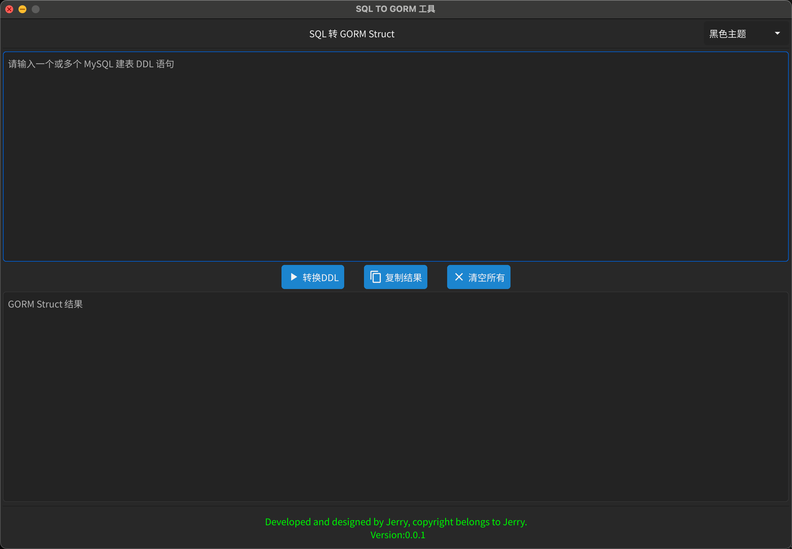
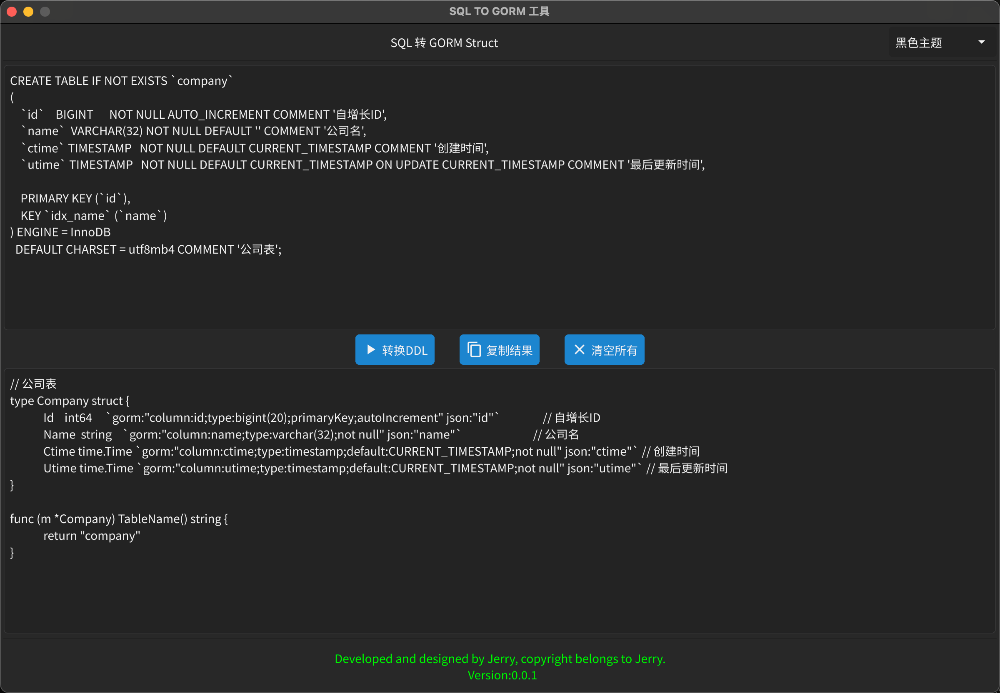
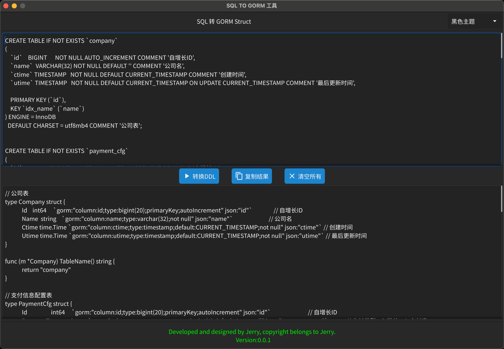

# sql2gorm-tool

SQL DDL 转 gorm struct 工具

## Mac编译

```shell
CGO_ENABLED=1 GOOS=darwin GOARCH=amd64 go build -ldflags="-s -w" -o sql2gorm main.go
```

## Windows编译

```shell
CGO_ENABLED=1 GOOS=windows GOARCH=amd64 CC=x86_64-w64-mingw32-gcc go build -ldflags="-s -w" -o sql2gorm.exe main.go
```

## Mac使用说明

1、cd到 sql2gorm 存放文件夹

```shell
sudo chmod +x sql2gorm
```

2、将 sql2gorm 移动到 `/usr/local/bin/` 目录下

```shell
sudo cp sql2gorm /usr/local/bin
```

3、运行 sql2gorm

```shell
sql2gorm
```

## Windows使用说明

直接双击打开 sql2gorm.exe

## 截图

- 首页<br>


- 单个 DDL 转换<br>


- 多个 DDL 转换<br>

